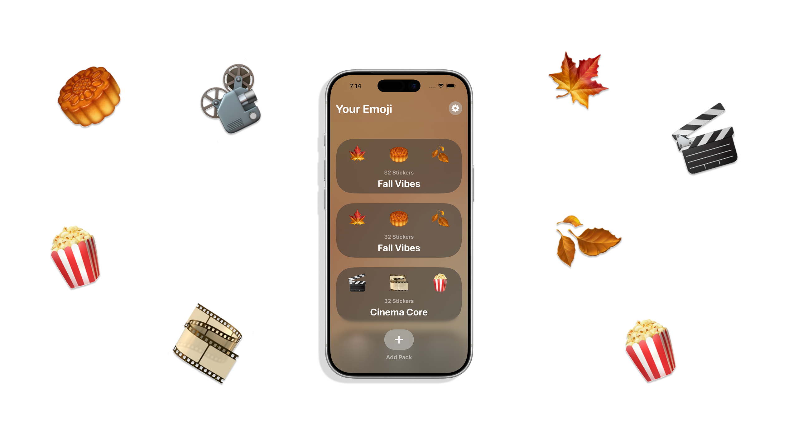

# EmojiHubUI

Emoji Hub is a playful space for creating and collecting expressive, AI-generated emoji stickers. The idea is simple - pick a theme, generate custom stickers that match it, arrange them into a pack, and share that pack with friends. Whether it’s Fall Vibes, Cozy Christmas, or a completely personal aesthetic, users can build their own visual language and use it across conversations.

The app is designed for people who treat self-expression as a creative outlet, users who curate Pinterest boards, customize cases, or decorate their home screens for every season. Emoji Hub gives them a lightweight, joyful way to extend that creativity into messaging, with the flexibility to add an entire pack to the keyboard or just a single sticker they love.

From the beginning, the goal was to build a UI that feels warm and personal without ever competing with the content. Since the stickers are the main characters, the interface had to support them quietly through soft gradients, unobtrusive surfaces, and fluid motion that makes the app feel alive while staying out of the spotlight.

A key constraint guided the entire design: the UI must adapt to the user’s personality without overpowering their creations. This meant crafting a visual system that is expressive yet understated, and a layout that scales from a single empty pack to a full grid of stickers.

Emoji Hub became an opportunity to explore how far SwiftUI could be pushed to achieve this balance, leveraging custom backgrounds, blur effects, subtle animation, and responsive layouts to create an interface that feels handcrafted, friendly, and unmistakably personal.
